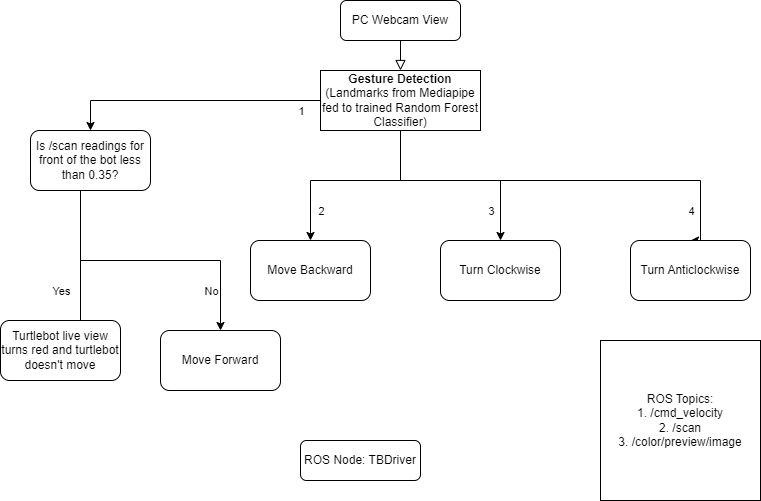

About
====
Collaborative robots are a form of robotic automation built to work safely alongside human workers in a shared, collaborative workspace. In most applications, a collaborative robot is responsible for repetitive, menial tasks while a human worker completes more complex and thought-intensive tasks. The accuracy, uptime and repeatability of collaborative robots is designed to complement the intelligence and problem-solving skills of a human worker.

Collaborative robot designs differ greatly from their industrial robot counterparts. Featuring rounded edges, force limitations, and light weights, collaborative robots are first and foremost designed for safety. Most collaborative robots are equipped with a series of sensors to avoid collisions with human workers, as well as safety protocols to shut down if any form of unplanned contact occurs.

The ability to work collaboratively with humans greatly expands the potential applications of robotic automation. The market for collaborative robots is expected to experience exponential growth as more and more industries realize the profits to be gained from this technology.

With major market potential in a number of industries inside and outside of the factory setting, collaborative robots will be an exciting technology to keep an eye on as it becomes a prominent form of robotic automation.

With the above points in mind we set out to make a unique project that combines machine learning and AI with a moveable robotic platform such as a Turtlebot 4 running ROS2 Galactic to get it to follow commands. The commands are hand gestures given by the user remotely using a webcam attached to a laptop. 

A RandomForrestCLassifier has been trained on X and Y coordinates of the hand landmarks generated by the mediapipe python library to accurately predict the commands based on the hand gestures provided by the user. The predicted commands are published as Twist messages over the ROS network to the /cmd_vel topic in the Turtlebot 4.

To learn more or try our project out yourself please visit: https://github.com/VishalNadig/hand-gesture-controlled-turtlebot4

Project Goals
----
Our primary objective was to create a collaborative robot using the Turtlebot 4 and remotely control it in real-time. To achieve this, we planned to utilize American Sign Language (ASL), a widely recognized method of communication using hand gestures. Our approach involved training a machine learning model on a large dataset of ASL images to accurately recognize signs made by the user and control the Turtlebot 4 accordingly. Additionally, we intended to incorporate a learning/teaching mode for the Turtlebot, enabling it to understand new gestures for new commands in the future. After testing the accuracy of the machine learning model, we aim to deploy it on a device connected to the same ROS network as the Turtlebot 4.

Project Workflow
----
Our primary goal for the project was to develop an accurate, efficient machine learning model to recognize American Sign Language (ASL) hand gestures and control the Turtlebot 4 remotely. Initially, we tried using a Convolutional Neural Network (CNN) model with a large dataset of ASL images, but the model was inaccurate, hyper-parameter tuning took a long time, and the system was lagging. We explored various CNN model architectures but found none to be efficient and accurate for our use case. We then chose to use the Mediapipe library for Python, which had a systematic way of collecting hand gesture data using 21 unique landmarks assigned to each part of the human hand. The X and Y coordinates of these landmarks could be exported to a CSV file and used to train a machine learning model.

Due to the inefficiency of the CNN model, we switched to a Random Forest Classifier model from scikit-learn. We also changed the dataset we used for training and testing, as the previous dataset was too large and complicated. We found a smaller dataset on kaggle that contained images of just the numbers used in ASL, which performed better and yielded over 95% accuracy on the model we trained. The Random Forest Classifier model was also much more efficient on the ROS network and used less computational power to predict the hand gestures. 

ROS Architecture
----

   
Tradeoffs
----
Tradeoffs mentioned we encountered during the implementation include (More details in the changelog):

Performance vs functionality tradeoff:
2.2.1: Switching from running ROS2 nodes in VirtualBox to Ubuntu 20.04 desktop in a dual boot system resulted in a performance improvement but requires a dual boot system.
Performance vs complexity tradeoff:
2.2.0: Combining three separate nodes into one Python node improved performance but the fastest approach without crash detection functionality may not be suitable for all use cases. Using separate edge computers may overcome limitations but increases complexity.
Performance vs scalability tradeoff:
2.1.2: Running multiple Python nodes caused performance issues due to Global Interpreter Lock (GIL) limitation, which affects scalability.
Accuracy vs latency tradeoff:
2.0.0: Previous approach was ineffective due to the model's size and lack of improvement in accuracy and latency. Adopting the Mediapipe python library improved accuracy but could still result in latency.
Accuracy vs resource utilization tradeoff:
2.0.2: Adopting a new approach that uses relational coordinates of hand landmarks for gesture recognition yielded higher accuracy but may use more resources.
Accuracy vs simplicity tradeoff:
2.0.1: Adopting the Random Forest Classifier in scikit-learn library for gesture recognition achieved a lower accuracy than the later adopted approaches but is simpler to implement.
Technical challenges vs performance tradeoff:
1.0.1: Using Tensorflow Lite instead of Tensorflow due to the absence of AVX and AVX2 instruction sets required by Tensorflow in Virtualbox running Ubuntu 20.04 may lead to lower performance. Dual-booting laptops with Ubuntu 20.04 and using Tensorflow to reduce inference time resulted in higher performance but requires a dual boot system.
Accuracy vs performance tradeoff:
1.0.2: Accurate predictions required segmentation of hands from the video feed, but this resulted in significant latency between video input and gesture recognition, hindering its use as a real-time control mechanism for the Turtlebot4.

Demo Video
----

`Screen Recording <https://youtu.be/q4oaOehS-fE>`_

`Live Test <https://youtu.be/BmBkIntueFs>`_

Elevator Pitch
----

Collaborative robots are designed to work safely alongside humans in a shared workspace, allowing humans to focus on complex tasks while robots perform repetitive tasks. Our project has combined machine learning and AI to create a unique collaborative robot, which can be controlled using hand gestures. The project uses a Turtlebot 4 running ROS2 Galactic, a RandomForrestCLassifier trained on hand gestures, and a webcam attached to a laptop/pc for gesture recognition. With its ability to recognize Numbers in American Sign Language, the robot can be remotely controlled with ease. This exciting technology can be deployed in a variety of industries, and you can try it out yourself by visiting the project's GitHub page.

`Elevator Pitch Video <https://youtu.be/doTDC-PYBUA>`_
